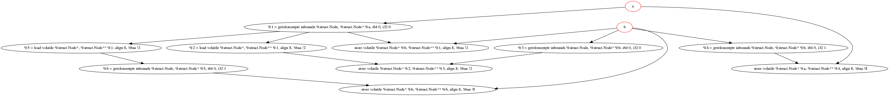

# LLVM-Program-Dependency-Graph-Generator

** Please make sure you have LLVM installed ** 

A pass that can generate PDG(in *.dot) for LLVM.

  As LLVM dosen't provide ways to generate Program Dependency Graph(PDG), and I need to use them in one of my project.
  I wrote this simple generation pass that can help generate PDG for a *.bc file.

  You can feel free to use it if you needed with simple insturctions like

`"opt -load ./pdg.so -pdg < "filename" > /dev/null"`

  and it will generate a *.dot format output for each functions in the *.bc file
like 

<pre><code>
digraph add{

"a" -> "  %1 = getelementptr inbounds %struct.Node, %struct.Node* %a, i64 0, i32 0";
"a" [ color = red ]
"  %1 = getelementptr inbounds %struct.Node, %struct.Node* %a, i64 0, i32 0" -> "  %2 = load volatile %struct.Node*, %struct.Node** %1, align 8, !tbaa !2";
"b" -> "  %3 = getelementptr inbounds %struct.Node, %struct.Node* %b, i64 0, i32 0";
"b" [ color = red ]
"  %2 = load volatile %struct.Node*, %struct.Node** %1, align 8, !tbaa !2" -> "  store volatile %struct.Node* %2, %struct.Node** %3, align 8, !tbaa !2";
"  %3 = getelementptr inbounds %struct.Node, %struct.Node* %b, i64 0, i32 0" -> "  store volatile %struct.Node* %2, %struct.Node** %3, align 8, !tbaa !2";
"b" -> "  %4 = getelementptr inbounds %struct.Node, %struct.Node* %b, i64 0, i32 1";
"b" [ color = red ]
"a" -> "  store volatile %struct.Node* %a, %struct.Node** %4, align 8, !tbaa !8";
"a" [ color = red ]
"  %4 = getelementptr inbounds %struct.Node, %struct.Node* %b, i64 0, i32 1" -> "  store volatile %struct.Node* %a, %struct.Node** %4, align 8, !tbaa !8";
"  %1 = getelementptr inbounds %struct.Node, %struct.Node* %a, i64 0, i32 0" -> "  %5 = load volatile %struct.Node*, %struct.Node** %1, align 8, !tbaa !2";
"  %5 = load volatile %struct.Node*, %struct.Node** %1, align 8, !tbaa !2" -> "  %6 = getelementptr inbounds %struct.Node, %struct.Node* %5, i64 0, i32 1";
"b" -> "  store volatile %struct.Node* %b, %struct.Node** %6, align 8, !tbaa !8";
"b" [ color = red ]
"  %6 = getelementptr inbounds %struct.Node, %struct.Node* %5, i64 0, i32 1" -> "  store volatile %struct.Node* %b, %struct.Node** %6, align 8, !tbaa !8";
"b" -> "  store volatile %struct.Node* %b, %struct.Node** %1, align 8, !tbaa !2";
"b" [ color = red ]
"  %1 = getelementptr inbounds %struct.Node, %struct.Node* %a, i64 0, i32 0" -> "  store volatile %struct.Node* %b, %struct.Node** %1, align 8, !tbaa !2";

}
</code></pre>

and picture like below can be genertated by using *.dot drawer.( "dot" command under *.unix with graphviz)

